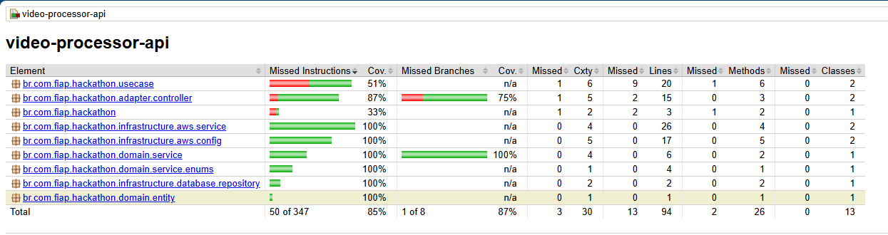

### 🎥 Video Processor API

API responsável pelo upload, consulta e histórico de vídeos processados no sistema. 
Desenvolvida como parte de um ecossistema maior de processamento de vídeos usando serviços gerenciados da AWS.

### 📌 Objetivo

Esta API recebe vídeos e informações de contato (e-mail), armazena os arquivos no S3 e envia mensagens para uma fila 
(SQS) para que um worker realize o processamento (extração de frames). Também permite consultar o histórico de vídeos processados.

### 🛠️ Tecnologias Utilizadas

- Java 21 com Spring Boot
- Maven para gerenciamento de dependências
- PostgreSQL (RDS) para consulta dos dados
- AWS S3 para armazenamento dos vídeos
- AWS SQS para comunicação com o serviço de processamento
- ECS Fargate para execução da aplicação
- GitHub Actions para CI/CD
- SonarQube para análise de qualidade de código

### 📬 Funcionalidades

- POST /upload
  - Upload do vídeo e envio da mensagem para a fila
- GET /search/by-email
  - Lista de vídeos por usuário
- GET /search/by-status/{status}
  - Lista vídeos por status [PROCESSING, ERROR, SUCCESS]

### Coverage Jacoco

